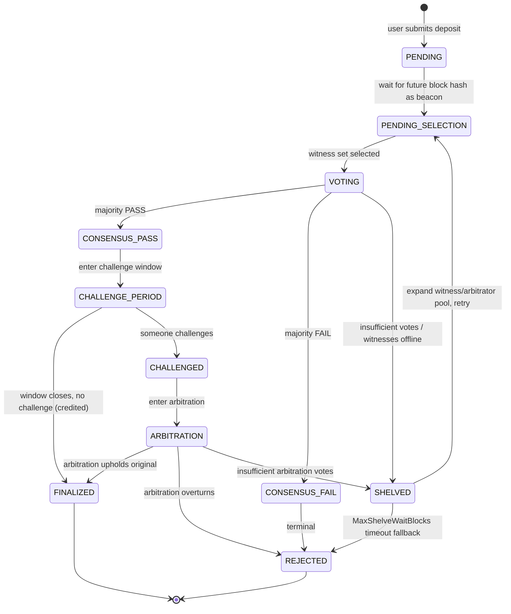
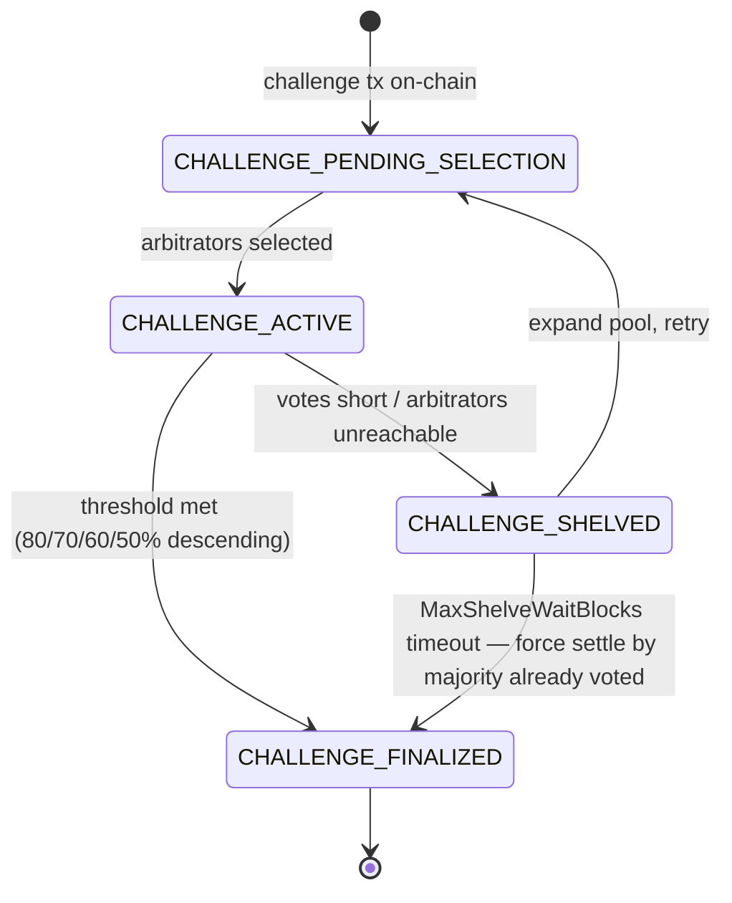
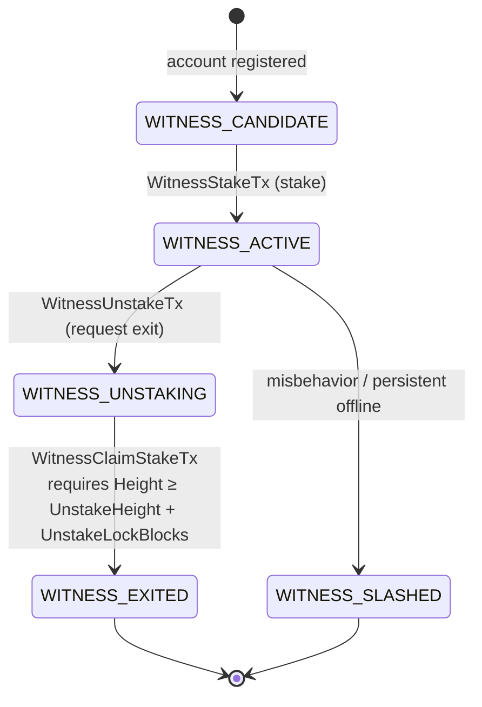
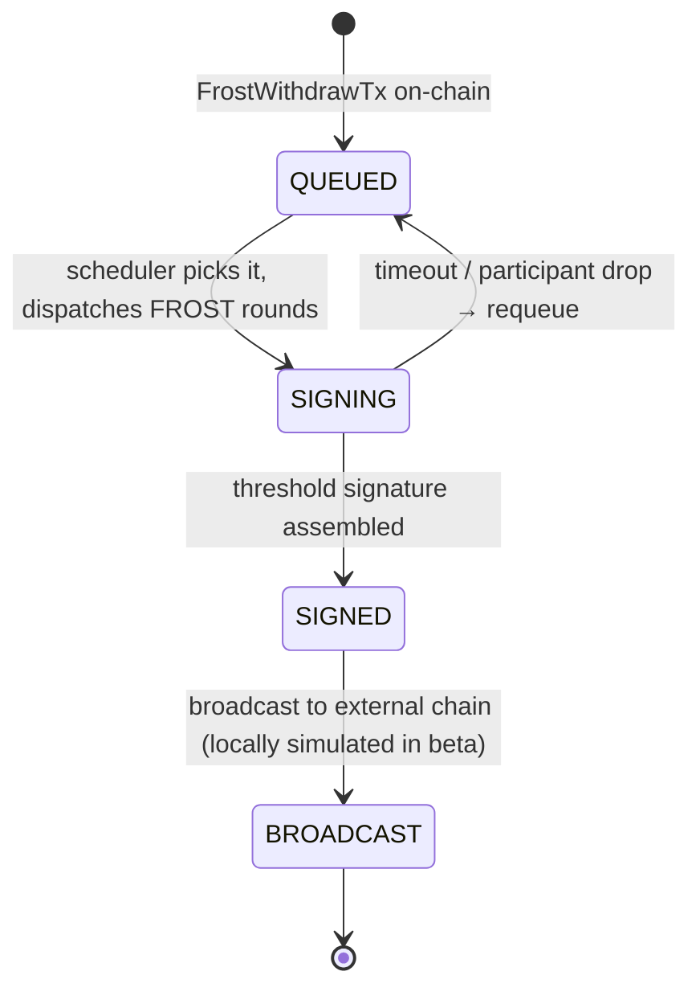

[简体中文](README.md) | **English**

# FrostBit Internal Test Guide

Welcome to the FrostBit internal beta! This handbook is a complete guide for testers, covering project background, reward rules, startup steps, frontend modules, caveats, and feedback channels.

---

## Table of Contents

- [0. Project Overview](#0-project-overview)
- [1. Internal Test Reward Rules](#1-internal-test-reward-rules)
- [2. Caveats (Read Before Testing)](#2-caveats-read-before-testing)
- [3. Release Package Layout & Startup](#3-release-package-layout--startup)
- [4. Wallet Connection & Miner Key Import](#4-wallet-connection--miner-key-import)
- [5. Frontend Modules](#5-frontend-modules)
- [6. Key State Transition Diagrams](#6-key-state-transition-diagrams)
- [7. FAQ](#7-faq)
- [8. Feedback Template (for GitHub Issues)](#8-feedback-template-for-github-issues)

---

## 0. Project Overview

**FrostBit** is a **fully decentralized** on-chain exchange — **no central operator, no central market maker, and even the cross-chain assets themselves are not held by any centralized custodian**. What you can do:

- **Spot trading** — Buy and sell any registered token on-chain, place/cancel limit orders, view order book depth and trade history
- **Perpetual futures** — Long/short both directions, select leverage, add/withdraw margin, watch mark price and funding rate; auto-liquidation at the liquidation line
- **Cross-chain deposits & withdrawals** — Bring BTC / ETH / BNB / TRX in as on-chain assets and take them back out the same way. **Assets are custodied collectively by the entire network; no single party can move your funds**
- **Token management** — Browse, issue, view holder distribution and trading pairs
- **Browser wallet** — Manage accounts, sign transactions, connect to DApps via the FrostBit Wallet extension
- **Block explorer** — Inspect blocks, transactions, addresses, and a live chain-wide transaction stream

> **Current stage**: internal beta (simulation). The entire system runs on a single machine — no servers, no real wallet, no real BTC required.

---

## 1. Internal Test Reward Rules

We want bugs, design flaws, and usability issues to surface early. Participation is simple:

### 1.1 How to file a bug

1. Open an issue in the **Issues** tab of this GitHub repository
2. **Title**: a one-sentence summary of the symptom
3. **Body** should contain at least:
   - Repro steps (which module, which button, what inputs)
   - Expected result vs. actual result
   - Your wallet address (copy from the FrostBit Wallet extension — used to pay reward tokens)
   - If possible, the last 20 lines of `dex.exe` / `explorer.exe` terminal output, or a screenshot of the browser DevTools console

### 1.2 How rewards are calculated

- After mainnet launch, project tokens will be distributed to your supplied wallet address based on the **count of valid issues**
- "Valid" means: reproducible, non-duplicate, not an obvious misoperation
- **Quality bonus**: issues that attach a PoC, pinpoint the module/transaction type, or suggest a fix get extra weight
- **Severity bonus**: crash > asset loss > functional bug > UX issue

### 1.3 How to get your wallet address

After installing the FrostBit Wallet extension, **create a new account locally inside the extension** (set password → generate mnemonic → back up the mnemonic → done). The address shown at the top of the account detail page is yours. **This address is generated locally, the private key stays on your machine; just paste it into the issue. When mainnet launches, rewards are paid to the same address.**

> ⚠️ Don't use any of the miner accounts imported from `miner_keys.txt` as your reward address — those are public test keys shared with everyone, not yours. The reward address must be **one you generated locally, whose private key nobody else has**.

> Note: issues are not limited to bugs — **improvement suggestions, documentation errors, UI issues** all count.

---

## 2. Caveats (Read Before Testing)

### 2.1 Fully local — no real cross-chain needed

This is the most commonly misunderstood point: **the entire FrostBit system runs on your own machine**. Don't mess with real BTC testnets, don't hunt for faucets, don't spend real bitcoin.

| Module | Theoretical (post-mainnet) | Internal test handling |
| --- | --- | --- |
| Block production / consensus / sync | Multiple physical nodes across data centers | 30 local processes — behaviorally equivalent |
| Spot / perpetual matching | Real-time on-chain matching | Identical — local really is the chain |
| BTC / ETH deposit | Witnesses observe the external tx and vote on-chain | **The external tx hash can be filled in arbitrarily**. The witness voting flow still runs — you can use this to test "rejection of fake hashes", "duplicate-hash deduplication", "multi-round voting", etc. |
| BTC / ETH withdrawal | After FROST signing completes, a node broadcasts to the external chain | The signing flow runs end-to-end; the broadcast step is locally simulated. You get full visibility into FROST rounds, signer set selection, timeout retries, etc. |
| Wallet extension | Install in any Chrome / Edge | Load the `wallet\` directory; everything stays on your machine during the beta |

### 2.2 Data can be wiped at any time

Don't worry about "breaking" anything. To start over from block 0: stop `dex.exe` / `explorer.exe`, delete the `data\` and `explorer_data\` folders, restart — fresh chain. See [Section 3.6](#6-start-a-fresh-chain-optional).

### 2.3 This is a simulation prototype, not a production build

- All 30 nodes run as processes on the same machine — not a real 30-server network
- Performance numbers are indicative only, not production metrics
- **Primary testing focus: do the numbers and accounting match expectations?** For each operation, compute it by hand and compare with what the chain shows:
  - **Order placement / fill**: is the frozen amount on placement correct? After a fill, does the buyer/seller balance delta equal `fill_qty × fill_price`? For partial fills — is the remaining order, fee deduction, and post-cancel refund accurate?
  - **Perpetuals**: opening margin, liquidation price, unrealized PnL, funding settlement, available balance after margin add/withdraw — all strictly consistent?
  - **Cross-chain deposit / withdrawal**: credited amount after witness pass = declared amount − fee? Withdrawal debit, lock, broadcast status transitions — every number lines up?
  - **Token supply**: after mint/transfer/burn, total supply is conserved; sum of all holder balances equals total supply
  - **Miner rewards**: block rewards distributed per the rule; total aligned with block count
- When filing issues, please write **"I calculated X, the UI shows Y"** so we can pinpoint quickly

### 2.4 Ports and firewall

- Ports in use: **6000–6029** (consensus) and **8080** (web frontend)
- When the Windows firewall prompts on first launch, click **"Allow access"** for every prompt, otherwise nodes can't reach each other

---

## 3. Release Package Layout & Startup

### Download the release

1. Open the Releases page: **<https://github.com/jihhngindy-png/frostbit/releases>**
2. Pick the top release (`v0.1`, `v0.2`, … higher number = newer). In the **Assets** section, click `dex-vX.Y-windows-amd64.zip` to download
3. **Extract** the zip to disk (e.g. `D:\dex`). You should get a `dex` directory whose layout is described below
4. All subsequent steps use this extracted `dex` directory as the working directory

> 💡 Only **Windows 10/11 64-bit** is supported. macOS / Linux prebuilt packages are not provided in the current version.
>
> 💡 When upgrading to a new version, always **extract into a fresh empty directory** rather than overlaying on top of an old one. Old `data\` / `explorer_data\` may be incompatible with the new build — see [3.6 Start a fresh chain](#6-start-a-fresh-chain-optional).

### Release package structure

```
dex\
├── dex.exe              ← Chain node cluster
├── explorer.exe         ← Explorer backend
├── README.md            ← Simplified Chinese version
├── README.en.md         ← This file (English)
├── config\              ← Genesis / frost / witness config
├── explorer\
│   └── dist\            ← Frontend static assets
└── wallet\              ← FrostBit Wallet browser extension
(On first launch, data\, explorer_data\, logs\, and miner_keys.txt are auto-generated)
```

### 1. Preparation

- Extract the whole `dex` directory to disk (e.g. `D:\dex`). **Do not copy exe files alone** — they depend on the sibling `config\` and `explorer\dist\` directories
- Make sure ports **6000–6029** and **8080** are free on your machine
- On the first Windows firewall prompt, click "Allow access" for everything
- **Install the FrostBit Wallet browser extension**:
  1. Open Chrome / Edge, navigate to `chrome://extensions`
  2. Toggle **Developer mode** in the top-right
  3. Click **Load unpacked** and select the `wallet` directory from the release package
  4. The FrostBit Wallet icon will appear in the browser toolbar

  > After unpacking a new version, reload the extension: in `chrome://extensions`, find FrostBit Wallet and click the refresh icon.

### 2. Start the chain nodes (dex.exe)

Easiest path: **double-click `dex.exe`** in File Explorer. Or via PowerShell / CMD:

```powershell
cd D:\dex
.\dex.exe
```

You know it's up when you see output like:

```
Starting 30 real consensus nodes...
Initializing and starting all nodes via NodeLauncher...
  Node 0 registered in registry
  ...
All nodes started! Press Ctrl+C to stop...
Monitoring consensus progress...
```

By default **30 nodes** are launched; the first 20 are miners, ports are `6000 … 6029`. **Don't close this window** — closing it stops the whole chain.

### 3. Start the explorer service (explorer.exe)

Open **another** terminal (or double-click `explorer.exe`), keeping the dex window untouched:

```powershell
cd D:\dex
.\explorer.exe
```

Success when you see `Explorer listening at http://127.0.0.1:8080`.

### 4. Open the frontend

In your browser, visit: **<http://127.0.0.1:8080>**

Use Chrome or Edge. Once loaded, the top-right corner offers a **language toggle** between Chinese and English.

### 5. Shutdown order

When done, **stop the explorer first, then the chain**:

1. Focus the `explorer.exe` window, press `Ctrl + C`
2. Focus the `dex.exe` window, press `Ctrl + C`, wait for `All nodes stopped. Goodbye!`

> Force-closing the dex window may corrupt in-flight block data. Always exit gracefully with `Ctrl + C`.

### 6. Start a fresh chain (optional)

To wipe all history and restart from block 0:

1. Confirm `dex.exe` and `explorer.exe` are both stopped
2. Delete `dex\data\` (node state)
3. Delete `dex\explorer_data\` (explorer index)
4. Restart by repeating steps 2 and 3

---

## 4. Wallet Connection & Miner Key Import

Any operation involving orders, deposits, withdrawals, or token issuance requires a connected wallet. Installation: see [3.1](#1-preparation).

### 4.1 Import miner keys (miner_keys.txt)

On first launch, `dex.exe` generates `miner_keys.txt` in the same directory:

```
# index: 0  address: bc1q...
aabbccdd... (64-hex private key)
# index: 1  address: bc1q...
11223344...
```

These miner accounts come with initial balances — once imported, you can place orders, transfer, and test cross-chain.

1. Click the FrostBit Wallet icon in the toolbar
2. On the import page, find the **"Batch import accounts"** section
3. Open `miner_keys.txt`, copy the whole content, paste into the textarea (`#` comment lines are auto-skipped, only 64-hex private keys are recognized)
4. Enter the wallet password, click **📥 Import accounts**
5. Done when you see "Imported N accounts"

### 4.2 Connect the wallet

1. Open the Explorer page (`http://127.0.0.1:8080`)
2. Click **"Connect Wallet"** in the top-right
3. In the extension popup, pick an account and approve
4. Once connected, the top bar shows the current address and balance

Clicking a trade button while disconnected shows a "Please connect wallet first" prompt.

> 💡 **The wallet address you file with an issue** is any account's address from the extension — use the one you mainly test with.

---

## 5. Frontend Modules

After opening the frontend, the left-side nav shows **10 modules**. Below, in nav order:

### 5.1 Node Monitor

The default home page — watch the whole chain run.

**What to look at:**
- Left pane "available node pool" lists all 30 nodes — single, multi, or select-all
- Selected nodes appear in the top control center with live height, accepted height, latency, FROST task count, pending tx count, candidate block count
- Each node card has a status badge: **online / offline / warning / paused**
- Miner nodes also show **miner status** and liveness
- "Block metadata" toggle: shows latest block's miner / state root / tx type distribution
- "Frost metrics" toggle: shows memory, goroutine count, FROST task count, etc.

**What you can do:**
- **Start/stop mining**: toggle miner status on any node to test dynamic join/leave
- **Pause/resume node**: simulate offline scenarios and observe catch-up
- **Snapshot sync toggle**: whether a new node uses snapshot or sync-from-zero
- **Auto sync**: refreshes selected-node status every 5 seconds
- Click a node card to open a detail modal with recent logs and blocks
- Click the "candidate blocks" number to pop up the list of unfinalized block headers

### 5.2 Block Explorer

Manual chain-data lookup.

**The search box accepts 4 input types**: block height, block hash, transaction hash, account address.

**Detail pages:**
- **Block detail**: height, hash, parent hash, state fingerprint, miner, tx list, block reward
- **Transaction detail**: hash, type, sender, type-specific payload (transfer, order, DKG participation, threshold signature, etc.)
- **Address detail**: balance, tx history, filter by type

A **recent blocks** feed sits below for quick drill-in.

### 5.3 DEX Pool

Test spot and perpetual orders. Two tabs:

#### Spot
- **Pair dropdown**: searchable; pick a registered pair or type manually
- **Order book**: real-time buy/sell depth, click to copy a price
- **Trade history**: recent matches
- **Limit orders**: connect wallet, enter price and quantity, place buy/sell
- **My orders**: filter by open / filled / all

#### Futures
- Top metrics: **mark price, spot price, index price, funding rate, insurance fund** (live)
- **Current position**: long/short direction, size, entry price, liquidation price, unrealized PnL
- **Margin operations**: per-position **add / withdraw margin** (with max-withdrawable hint)
- **Limit order** + **leverage picker**
- **My orders / order book / trade history** — same as Spot

> Both sub-tabs require "Connect Wallet" in the top-right first.

### 5.4 Withdraws

FROST-threshold-signed **cross-chain withdrawal queue**.

- Each withdrawal's state: queued / signing / signed / broadcast / completed
- Click any entry to open the detail modal: full **FROST rounds**, participating witnesses, external-chain tx info
- Used to verify: is the t-of-n threshold triggered correctly? Is signer selection uniform? Does timeout-retry work?

> In the internal test, the "broadcast" step is locally simulated — nothing actually hits the BTC chain. You can still see the full protocol rounds and signature data, which is the whole point.

### 5.5 Witness

The witness observation + voting flow for cross-chain events.

- List of pending witness requests (height, type, status)
- Each request expands to show which witnesses have signed / not
- Used to verify behavior under witness offline, disagreement, timeout, shelving

### 5.6 Miner

The miner-centric node list — complements "Node Monitor":

- Only shows the currently active miner set
- Shows **liveness status**, consensus height, recent block production
- Useful for confirming miner-set updates across miner joins/leaves and epoch changes

### 5.7 Bridge

Deposit / withdrawal entry points for BTC / ETH / BNB / TRX.

**Deposit test flow (locally simulated):**
1. Connect wallet
2. On the "Request deposit address" panel, click to generate a one-time receiving address
3. The **external tx hash** field — just fill any 64-hex string (e.g. paste a block hash). What we're verifying is the on-chain witness flow, not an actual fund movement
4. Fill amount and decimals (only needed for ERC20 / TRC20), submit
5. Switch to "Witness" to watch the vote
6. After the vote passes, the balance shows in the address detail

**Withdrawal test flow:**
1. In "Initiate withdrawal" form, fill token address, destination address, amount
2. Sign and submit
3. Switch to "Withdraws" to watch signing progress
4. After signing completes, the state moves to "broadcast" — which is locally simulated in this beta, nothing actually reaches the BTC chain

### 5.8 Frost DKG

FROST DKG (Distributed Key Generation) session timeline:

- Participants, current round, round timing per session
- Failures / retries
- Fingerprint of the generated public key
- Used to confirm the key is regenerated as expected after a miner-set change

### 5.9 Tokens

Token registry browse and lookup:

- Lists all issued tokens: symbol, supply, issuer, decimals
- Click for holder distribution and registered trading pairs
- Used to verify issue, mint, burn transactions on-chain

### 5.10 Recent Txs

A live scrolling view of the latest chain-wide transactions:

- Filter by tx type (transfer, order, cancel, deposit, withdrawal, DKG, signature, etc.)
- Click any tx for a detail modal — no need to jump to "Block Explorer"
- Useful as a "live monitor" during stress testing or regression checks

---

## 6. Key State Transition Diagrams

The four diagrams below map the pipelines most prone to getting stuck mid-state. During testing, use them as a reference: which cell is the on-chain state in, what's the next step, which edge is the timeout fallback?

### 6.1 Recharge Request (RechargeRequest)



**Testing focus**: the `SHELVED → PENDING_SELECTION` retry, the `SHELVED → REJECTED` timeout fallback, challenge window duration, whether balance correctly credits after `CHALLENGE_PERIOD → FINALIZED`.

### 6.2 Challenge & Arbitration (ChallengeRecord)



**Testing focus**: whether challenge stake is frozen correctly, whether arbitrator re-selection uses future block hash, whether the timeout fallback conservatively infers the outcome, whether post-settlement stake refund / slash reconciles.

### 6.3 Witness / Miner Lifecycle (WitnessStatus)



**Testing focus**:
- After `ACTIVE → UNSTAKING`, the witness **is immediately excluded from new tasks**, but must finish `pending_tasks` leftover
- Calling `WitnessClaimStakeTx` before the lock period (`UnstakeLockBlocks`, default 20 blocks) should be rejected
- `witness_locked_balance` in `UNSTAKING` must not be movable before claim
- For the `WITNESS_SLASHED` path, watch where the slashed funds go (insurance fund / challenger)

### 6.4 Cross-chain Withdrawal (FROST Withdraw)



**Testing focus**: whether FROST rounds progress as expected, whether signer selection is balanced, whether timeout-retry actually falls back to `QUEUED` and reschedules, whether the `SIGNED → BROADCAST` tx hash can be cross-referenced.

---

## 7. FAQ

| Symptom | Steps to check |
| --- | --- |
| Browser blank at `127.0.0.1:8080` | Confirm `explorer.exe` is still running and its last line is `Explorer listening at …`; refresh page |
| All nodes show "offline" | Confirm `dex.exe` is still running; run `netstat -ano \| findstr 6000` to see if port 6000 is listening |
| Withdrawal stuck on "signing" | In "Frost DKG" check for an active DKG session; if miners < threshold, signing can't complete |
| Order submitted but book unchanged | Check "Node Monitor" for growing pending-tx count — confirm the tx entered a node's txpool |
| Data looks off after restart | Per [3.6](#6-start-a-fresh-chain-optional) wipe `data/` and `explorer_data/` then restart |
| `dex.exe` errors with port in use | Previous run didn't exit cleanly. Kill leftover `dex.exe` / `explorer.exe` in Task Manager and retry |
| Frontend buttons unresponsive | Open browser DevTools (F12), look for red errors; screenshot and report |
| Wallet extension icon missing | In `chrome://extensions`, confirm the `wallet\` directory is loaded and "Developer mode" is on |
| Can't fill "external tx hash" for deposit | During beta, any 64-hex string will do — no real BTC tx required |

---

## 8. Feedback Template (for GitHub Issues)

```markdown
### Symptom
One sentence (e.g.: After adding margin to a perpetual position, the UI's unrealized PnL didn't refresh)

### Repro steps
1. Start dex.exe + explorer.exe
2. Open frontend → Connect Wallet (account 0)
3. Navigate to DEX Pool → Futures
4. Place a BTC/USDT 10x long
5. Click "Add margin" 100 USDT

### Expected
Unrealized PnL refreshes with the new margin

### Actual
Number stays the same until page is refreshed

### Environment
- Node count: 30 (default)
- Data wiped: yes / no
- Snapshot sync: on / off

### My wallet address (for rewards)
bc1q...xxxx

### Attachments
- Last 20 lines of dex.exe output (optional)
- Browser DevTools console screenshot (optional)
```

---

Happy testing — we look forward to your issues!
