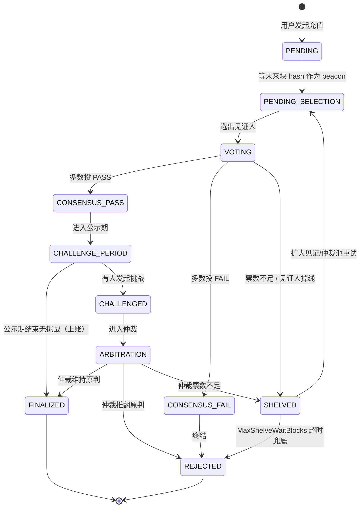
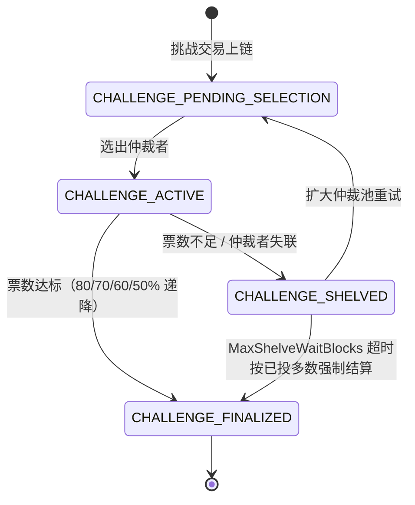
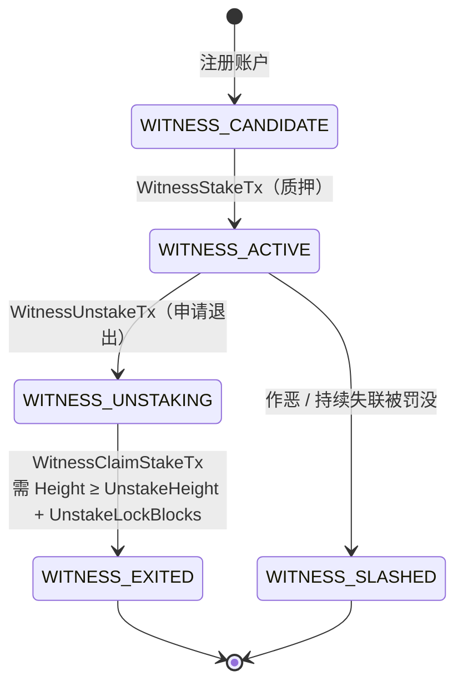
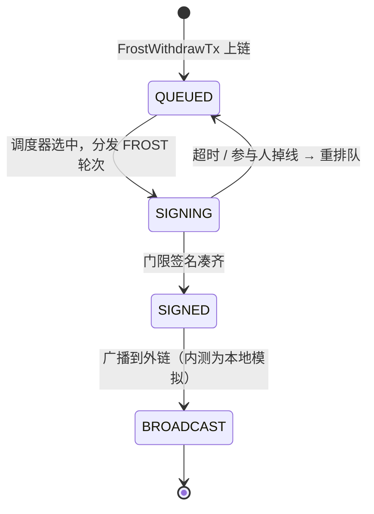

**简体中文** | [English](README.en.md)

# FrostBit 内测手册

欢迎参与 FrostBit 的内测！本手册是给测试员的完整指南，覆盖项目背景、奖励规则、启动步骤、前端模块、注意事项和反馈方式。

---

## 目录

- [零、项目简介](#零项目简介)
- [一、内测奖励规则](#一内测奖励规则)
- [二、注意事项（读完再开始测）](#二注意事项读完再开始测)
- [三、发布包目录与启动](#三发布包目录与启动)
- [四、钱包连接与矿工私钥导入](#四钱包连接与矿工私钥导入)
- [五、前端功能模块](#五前端功能模块)
- [六、关键状态流转图](#六关键状态流转图)
- [七、常见问题](#七常见问题)
- [八、反馈模板（GitHub Issue 直接复用）](#八反馈模板github-issue-直接复用)

---

## 零、项目简介

**FrostBit** 是一个**完全去中心化**的链上交易所——**没有中心化运营方、没有中心化做市商、连跨链资产本身也不在任何中心化托管方手上**。你能做的事：

- **现货交易**：在链上买卖已注册代币，限价挂单、撤单、查看盘口和成交历史
- **永续合约**：多空双向、可选杠杆、追加/提取保证金、查看标记价与资金费率，到强平线自动强平
- **跨链充值与提现**：把 BTC / ETH / BNB / TRX 打进来当链上资产用，也能原路提回去——**资产由全网集体保管，没有任何一方能单独动你的币**
- **代币管理**：浏览、发币、查看持有者分布和交易对
- **浏览器钱包**：FrostBit Wallet 扩展里管账户、签交易、连 DApp
- **区块浏览器**：查区块、查交易、查地址，看全链实时交易流

> **当前阶段**：内测（仿真测试）。整套系统在你本机一台电脑上即可跑起来，不需要服务器、不需要真钱包、不需要真 BTC。

---

## 一、内测奖励规则

我们希望尽早发现 bug、设计缺陷、使用问题。参与方式极简：

### 1.1 怎么提 bug

1. 在 GitHub 本仓库 **Issues** 板块提交 issue
2. **标题**写清现象的一句话概括
3. **正文**至少包含：
   - 复现步骤（哪个模块、点了什么按钮、填了什么内容）
   - 期望结果 vs 实际结果
   - 你钱包里的地址（从 FrostBit Wallet 扩展复制即可，用于发奖励 token）
   - 如有可能，附上 `dex.exe` / `explorer.exe` 终端最后 20 行输出，或浏览器 F12 控制台截图

### 1.2 奖励怎么算

- 正式主网上线后，按**有效 issue 数量**向你提供的钱包地址发放项目 token
- "有效"标准：能复现、非重复提交、非明显误操作
- **质量加成**：附 PoC、精确定位到模块/交易类型、给出修复建议的 issue 会额外加权
- 严重程度加成：崩溃类 > 资产损失类 > 功能异常 > 体验问题

### 1.3 怎么拿到钱包地址

装好 FrostBit Wallet 扩展后，在扩展里**本地生成一个新账户**（设密码 → 生成助记词 → 备份好助记词 → 完成），账户详情页顶部显示的就是你的地址。**这个地址是你本地生成、私钥只在你本机，填 issue 的时候粘贴过来即可；主网上线时会按同一个地址发放奖励。**

> ⚠️ 不要用 `miner_keys.txt` 里导入的那批矿工账户做奖励地址——那些是全员公开的测试私钥，不是你自己的。奖励地址必须是**你自己本地生成、别人拿不到私钥**的那个。

> 注：issue 提交不限于 bug，**改进建议、文档错误、UI 问题** 同样计入统计。

---

## 二、注意事项（读完再开始测）

### 2.1 全本地即可，不需真跨链

这是最容易被误解的一点：**整套 FrostBit 在你本机运行就够了**，不要去折腾真实 BTC 测试网、不要去找水龙头、不要去真花比特币。

| 模块 | 理论（主网上线后） | 内测怎么处理 |
| --- | --- | --- |
| 出块、共识、同步 | 多物理节点跨机房 | 本机 30 个进程模拟，完全等价 |
| 现货 / 永续下单撮合 | 链上实时撮合 | 完全一致，本地就是真链 |
| BTC / ETH 充值 | 见证人观察外链 tx 后投票上链 | **外链 tx hash 可随意填**，见证人本地投票流程照常走；你可以用它专门测"假 hash 能否被拒"、"重复 hash 能否去重"、"多轮投票" 等 |
| BTC / ETH 提现 | FROST 签名完成后由节点广播到外链 | 签名流程完整跑，广播部分为本地模拟；你能看到 FROST 多轮交互、矿工集合选举、超时重签等完整细节 |
| 钱包扩展 | 装在任意 Chrome / Edge | 加载 `wallet\` 目录即可，内测期间所有数据都只在本地 |

### 2.2 所有数据都可以随时清零

不用担心"搞坏了"。任何时候想从 0 重来，只要停掉 `dex.exe` / `explorer.exe`，删掉 `data\` 和 `explorer_data\` 两个文件夹，再启动就是一条全新链。详见[第三章第 6 节](#6-从零开始一条新链可选)。

### 2.3 这是仿真原型，不是生产版

- 节点之间跑在同一台机器同一个进程组内，你看到的 30 个节点不是 30 台服务器的真实网络
- 性能数据仅供参考，不等于生产指标
- **测试重点：数额与对账是否符合预期**。每一笔操作都请自己手工算一遍，看链上数字对不对：
  - **下单 / 成交**：挂单后冻结数量对不对？成交后买卖双方余额变化是否等于 `成交数量 × 成交价`？部分成交的剩余挂单、手续费扣除、撤单后余额退还是否准确？
  - **永续合约**：开仓保证金、强平价计算、未实现盈亏、资金费率结算、追加/提取保证金后可用余额是否严格一致？
  - **跨链充值 / 提现**：见证通过后到账数量 = 申报数量 − 手续费？提现扣款、锁仓、广播状态切换的每一步数字是否对得上？
  - **代币总量**：发币、转账、销毁后总量守恒，所有持有者余额之和等于总供应量
  - **矿工奖励**：出块奖励是否按规则分配，总量是否和区块数对得上
- 建议提 issue 时写清**"我算的是 X，实际显示 Y"**，便于我们定位

### 2.4 端口和防火墙

- 占用端口：**6000 ~ 6029**（节点共识）、**8080**（Web 前端）
- 首次启动 Windows 防火墙弹窗时**全部点"允许访问"**，否则节点互相连不上

---

## 三、发布包目录与启动

### 下载发布包

1. 打开 Releases 页面：**<https://github.com/jihhngindy-png/frostbit/releases>**
2. 选最上面的那条 release（比如 `v0.1`、`v0.2`……版本号越大越新），**Assets** 区域点击 `dex-vX.Y-windows-amd64.zip` 下载
3. 把 zip **解压**到磁盘（例如 `D:\dex`），解压后应该得到一个叫 `dex` 的目录，里面就是下面描述的结构
4. 后续所有步骤都以解压出来的这个 `dex` 目录为工作目录

> 💡 只支持 **Windows 10/11 64 位**。当前版本暂不提供 macOS / Linux 预编译包。
>
> 💡 建议每次发新版都**全新解压到空目录**，不要把新 zip 覆盖到旧目录上——旧的 `data\`、`explorer_data\` 可能跟新版本不兼容，详见 [3.6 从零开始一条新链](#6-从零开始一条新链可选)。

### 发布包目录结构

```
dex\
├── dex.exe              ← 链节点集群
├── explorer.exe         ← 浏览器后端
├── README.md           ← 本文件（简体中文）
├── README.en.md        ← English version
├── config\              ← 创世、frost、见证人配置
├── explorer\
│   └── dist\            ← 前端静态资源
└── wallet\              ← FrostBit Wallet 浏览器扩展
（首次启动后会自动生成 data\、explorer_data\、logs\、miner_keys.txt）
```

### 1. 准备工作

- 把整个 `dex` 目录解压到磁盘（例如 `D:\dex`），**不要把 exe 单独拷走**，程序运行依赖同级的 `config\`、`explorer\dist\`
- 确认本机 **6000–6029、8080** 端口没有被占用
- Windows 防火墙第一次弹窗，全部点"允许访问"
- **安装 FrostBit Wallet 浏览器扩展**：
  1. 打开 Chrome / Edge，地址栏输入 `chrome://extensions` 回车
  2. 打开右上角的**开发者模式**开关
  3. 点击**加载已解压的扩展程序**，选择发布包中的 `wallet` 目录
  4. 安装成功后浏览器工具栏会出现 FrostBit Wallet 图标

  > 每次解压新版本后要重新加载：进入 `chrome://extensions` 找到 FrostBit Wallet，点击刷新按钮即可。

### 2. 启动链节点（dex.exe）

最简单：在资源管理器中**双击 `dex.exe`**。或用 PowerShell / CMD：

```powershell
cd D:\dex
.\dex.exe
```

看到类似输出即表示启动完成：

```
Starting 30 real consensus nodes...
Initializing and starting all nodes via NodeLauncher...
  Node 0 registered in registry
  ...
All nodes started! Press Ctrl+C to stop...
Monitoring consensus progress...
```

默认拉起 **30 个节点**，前 20 个是矿工，端口依次 `6000 … 6029`。**这个窗口不要关**，关掉就等于停掉整条链。

### 3. 启动浏览器服务（explorer.exe）

**另开一个**终端窗口（或再双击一次 `explorer.exe`），保留上一步的 dex 窗口不动：

```powershell
cd D:\dex
.\explorer.exe
```

看到 `Explorer listening at http://127.0.0.1:8080` 即启动成功。

### 4. 打开前端

浏览器访问：**<http://127.0.0.1:8080>**

推荐使用 Chrome 或 Edge，打开后顶部右上角可以**中英文切换**。

### 5. 停止顺序

测试结束时，**先关浏览器服务，再关链节点**：

1. 切到 `explorer.exe` 窗口按 `Ctrl + C`
2. 切到 `dex.exe` 窗口按 `Ctrl + C`，等 `All nodes stopped. Goodbye!`

> 直接关闭 dex 窗口可能损坏正在写入的区块数据，建议始终用 `Ctrl + C` 优雅退出。

### 6. 从零开始一条新链（可选）

想清空所有历史数据、从 0 高度重来：

1. 确认 `dex.exe` 和 `explorer.exe` 都已停止
2. 删除 `dex\` 目录下的 `data\` 文件夹（节点状态）
3. 删除 `dex\` 目录下的 `explorer_data\` 文件夹（浏览器索引）
4. 重新按第 2、3 步启动

---

## 四、钱包连接与矿工私钥导入

凡涉及下单、充值、提现、发币等操作都要先连接钱包。钱包扩展安装见 [三.1](#1-准备工作)。

### 4.1 导入矿工私钥（miner_keys.txt）

`dex.exe` 首次启动会在同级目录生成 `miner_keys.txt`，格式如下：

```
# index: 0  address: bc1q...
aabbccdd...（64 位十六进制私钥）
# index: 1  address: bc1q...
11223344...
```

这些矿工账户初始就有余额，导入后即可下单、转账、测跨链。

1. 点击工具栏 FrostBit Wallet 图标打开扩展
2. 在导入页面下方找到 **"批量导入账户"** 区域
3. 打开 `miner_keys.txt`，全选复制，粘贴到文本框（`#` 注释行会自动跳过，只识别 64 位十六进制私钥）
4. 输入钱包密码，点 **📥 导入账户**
5. 提示"成功导入 N 个账户"即完成

### 4.2 连接钱包

1. 浏览器打开 Explorer 页面（`http://127.0.0.1:8080`）
2. 点击右上角 **"连接钱包"**
3. 在扩展弹窗中选择账户并授权
4. 连接成功后顶部会显示当前地址和余额

如果在未连接状态下点下单按钮，页面会提示"请先连接钱包"。

> 💡 **提 issue 时用到的钱包地址**，就是扩展里任意一个账户的地址，推荐直接用你主要测试的那个。

---

## 五、前端功能模块

浏览器打开后，左侧导航栏共 **10 个模块**。以下按导航顺序说明。

### 5.1 节点监控（Monitor）

默认主页，观察整条链运行情况。

**看什么：**
- 左侧"可用节点池"列出全部 30 个节点，可单选、多选、全选
- 选中的节点进入顶部控制中心，显示实时高度、已接受高度、延迟、FROST 任务数、pending 交易数、候选区块数
- 每个节点卡片有状态徽标：**在线 / 离线 / 警告 / 已暂停**
- 矿工节点额外显示**矿工状态**和活性状态
- "区块元数据"开关：展示最新区块的 miner / state root / 交易类型分布
- "Frost 指标"开关：显示内存、goroutine、FROST 任务数等运行时指标

**能做什么：**
- **加入挖矿 / 停止挖矿**：切换任意节点矿工身份，测动态加入/退出
- **暂停节点 / 恢复节点**：模拟掉线场景，观察其他节点追赶
- **快照同步开关**：新加入节点用快照还是从头同步
- **自动同步**：每 5 秒自动拉取所有选中节点状态
- 点击节点卡片可打开详情弹窗，查看最近日志和区块
- 点击"候选区块"数字弹出未最终化区块头列表

### 5.2 区块浏览器（Explorer）

手动查询链上数据。

**搜索框支持 4 种输入**：区块高度、区块哈希、交易哈希、账户地址。

**详情页：**
- **区块详情**：高度、哈希、前块哈希、状态指纹、出块矿工、交易列表、出块奖励
- **交易详情**：交易哈希、类型、发起方、具体载荷（按交易类型动态展示，如转账、下单、DKG 参与、门限签名等）
- **地址详情**：该地址余额、交易历史，可按类型过滤

下方还有 **最近区块** 滚动列表。

### 5.3 DEX 聚合池（DEX Pool）

测试现货和永续下单。两个子标签：

#### 现货（Spot）
- **交易对下拉**：支持搜索，可从已注册交易对中选，也可手动输入
- **盘口流动性**：实时买卖盘深度，可点击复制价格
- **历史成交**：最近撮合记录
- **限价委托**：连接钱包后输入价格、数量下买单 / 卖单
- **我的订单**：按未成交 / 已成交 / 全部过滤

#### 永续合约（Futures）
- 顶部指标：**标记价格、现货价格、指数价格、资金费率、保险基金**（实时）
- **当前仓位**：多空方向、持仓数量、入场价、强平价、未实现盈亏
- **保证金操作**：单仓位**追加 / 提取保证金**（带最大可提取额度提示）
- **限价委托** + **杠杆选择**
- **我的订单 / 订单簿 / 成交记录** 同现货

> 两个子模块都需先在右上角"连接钱包"。

### 5.4 提现管理（Withdraws）

展示 FROST 门限签名驱动的**跨链提现队列**。

- 列表显示每笔提现状态：排队 / 签名中 / 已签名 / 已广播 / 完成
- 点击任一提现打开详情弹窗，看完整的 **FROST 协议轮次**、参与签名的见证人、广播到外链的交易信息
- 用来验证：门限 t-of-n 是否正确触发、签名人选举是否均匀、超时是否重试

> 内测下"已广播"步骤是本地模拟，不会真正上 BTC 链——你能看到完整的协议轮次和签名数据，这是测试关键。

### 5.5 见证体系（Witness）

见证人对跨链事件的观察与投票流程。

- 待处理见证请求列表（区块高度、类型、见证状态）
- 每一条请求可展开，看哪些见证人已签、哪些没签
- 用来验证见证人离线、分歧、超时、搁置的行为

### 5.6 节点矿工（Miner）

矿工视角的节点列表，和"节点监控"互补：

- 只列出当前活跃矿工集合
- 显示**活性状态**、参与共识的高度、最近出块情况
- 多矿工切换、epoch 变更时确认矿工集正确更新

### 5.7 跨链操作（Bridge）

BTC / ETH / BNB / TRX 充值和提现入口。

**充值测试流程（本地模拟）：**
1. 连接钱包
2. 在"申请充值地址"面板点击生成一个一次性入金地址
3. **外链交易哈希**栏——内测直接填任意一个 64 位十六进制串即可（比如粘贴一个区块哈希）；我们要验证的是链上见证流程，不是真的打币
4. 填金额、精度（ERC20/TRC20 合约代币才需要）后提交
5. 切到 "见证体系" 观察见证人投票
6. 投票通过后余额会体现在"地址详情"中

**提现测试流程：**
1. 在"发起提现"表单填 Token 地址、目标地址、金额
2. 签名并提交
3. 切到 "提现管理" 查看签名进度
4. 签名完成会走到"已广播"——内测下这一步是本地模拟，不会真的打到 BTC 链

### 5.8 Frost 门限密钥（Frost DKG）

FROST DKG（Distributed Key Generation）会话时间线：

- 每次 DKG 会话的参与者、当前轮次、轮次用时
- 失败/重试次数
- 生成的公钥指纹
- 用于确认新一轮矿工变更后密钥是否如期重新生成

### 5.9 资产代币（Tokens）

Token 注册表浏览和查询：

- 列出所有已发行代币：符号、总量、发行方、精度
- 点击可查看该代币的持有者分布和已注册的交易对
- 验证发币、增发、销毁等交易在链上的效果

### 5.10 最近交易（Recent Txs）

全链最新交易的实时滚动视图：

- 按交易类型筛选（转账、下单、撤单、充值、提现、DKG、签名等）
- 点击任一交易弹出详情，无需跳到"区块浏览器"
- 适合压测或功能回归做"实时观测点"

---

## 六、关键状态流转图

下面四张图是测试过程中最容易出状态卡住的四条流水线。测试时可以对照着看：链上状态跳到了哪一格、下一步应该是什么、超时兜底走哪条边。

### 6.1 充值请求（RechargeRequest）



**测试要点**：`SHELVED → PENDING_SELECTION` 的重试、`SHELVED → REJECTED` 的超时兜底、挑战公示期的时长、`CHALLENGE_PERIOD → FINALIZED` 后余额是否正确上账。

### 6.2 挑战与仲裁（ChallengeRecord）



**测试要点**：挑战质押金额是否正确冻结、仲裁者重选是否走未来块 hash、超时兜底路径是否保守推断、结算后挑战者质押金退还或罚没是否对账。

### 6.3 见证人 / 矿工生命周期（WitnessStatus）



**测试要点**：
- `ACTIVE → UNSTAKING` 之后该见证人**立即不再被选入新任务**，但 `pending_tasks` 中的旧任务仍需处理完
- 锁定期（`UnstakeLockBlocks`，默认 20 块）未到前调 `WitnessClaimStakeTx` 应被拒
- `UNSTAKING` 中的 `witness_locked_balance` 在领回前不得动用
- `WITNESS_SLASHED` 路径观察罚没金额流向（保险基金 / 挑战者）

### 6.4 跨链提现（FROST Withdraw）



**测试要点**：FROST 轮次能否如期推进、签名人选举是否均匀、超时重签是否回退到 `QUEUED` 再次调度、`SIGNED → BROADCAST` 的交易哈希是否可核对。

---

## 七、常见问题

| 现象 | 排查步骤 |
| --- | --- |
| 浏览器打开 `127.0.0.1:8080` 白屏 | 确认 `explorer.exe` 窗口仍在运行，最后一行是 `Explorer listening at …`；刷新页面 |
| 节点全部显示"离线" | 确认 `dex.exe` 窗口还在运行；用 `netstat -ano \| findstr 6000` 检查 6000 端口是否在监听 |
| 提现一直卡在"签名中" | 切到 "Frost 门限密钥" 看是否有活跃 DKG 会话；矿工数不足 t 时签不出来 |
| 订单提交后盘口没变化 | 看"节点监控" pending 交易数是否在增长，确认交易是否进入某个节点的 txpool |
| 两次启动后数据看起来不对 | 按 [三.6](#6-从零开始一条新链可选) 清空 `data/` 和 `explorer_data/` 后重启 |
| `dex.exe` 启动报端口被占 | 上一次没有优雅退出，残留进程占用端口。任务管理器结束 `dex.exe` / `explorer.exe` 后重试 |
| 前端按钮点击无反应 | 浏览器 F12 打开控制台看有无红色报错；截图反馈给开发 |
| 钱包扩展图标不出现 | `chrome://extensions` 确认是否已加载 `wallet\` 目录，"开发者模式"开关是否打开 |
| 充值填不了"外链交易哈希" | 内测期间随便填一段 64 位十六进制即可，不需要真实 BTC tx |

---

## 八、反馈模板（GitHub Issue 直接复用）

```markdown
### 现象
一句话概括（例：永续合约追加保证金后，UI 显示的未实现盈亏没更新）

### 复现步骤
1. 启动 dex.exe + explorer.exe
2. 打开前端 → 连接钱包（账户 0）
3. 进入 DEX 聚合池 → 永续合约
4. 下一笔 BTC/USDT 10x 多单
5. 点击"追加保证金" 100 USDT

### 预期结果
未实现盈亏根据新保证金刷新

### 实际结果
数字未变，刷新页面后才更新

### 环境
- 节点数：30（默认）
- 是否清过数据：是 / 否
- 快照同步：开 / 关

### 我的钱包地址（奖励发放用）
bc1q...xxxx

### 附件
- dex.exe 最后 20 行输出（可选）
- 浏览器 F12 控制台截图（可选）
```

---

祝测试顺利，期待你的 issue！
